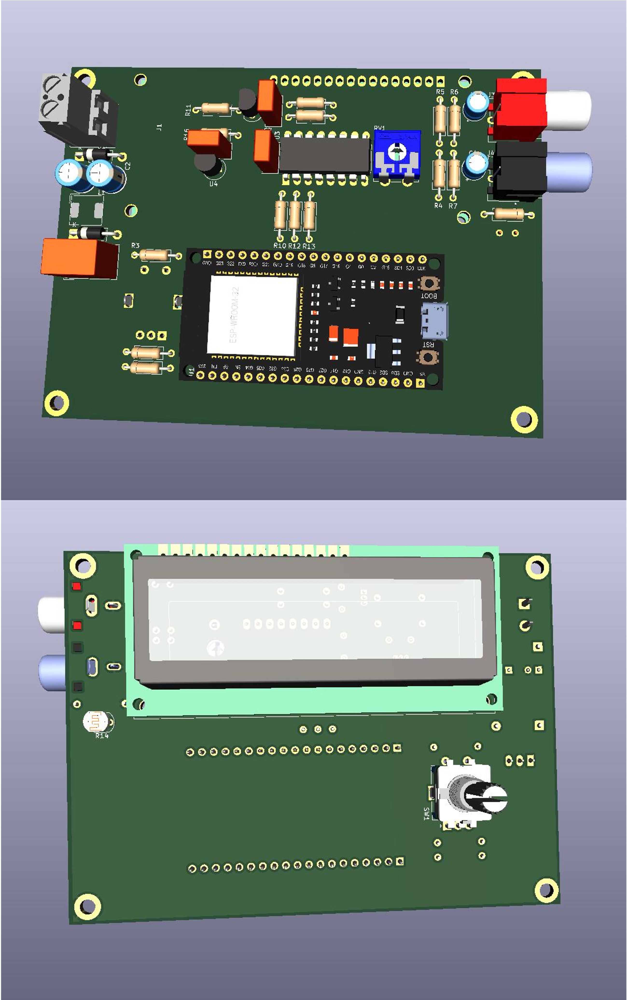

# ESP32-Webradio-Breakout

This project is a basic board to build an ESP32 webradio. All components like the microcontroller, 
display and the power supply should be compactly placed on a kind of breakout board. As an idea we used a
[blog article](https://www.az-delivery.de/blogs/azdelivery-blog-fur-arduino-und-raspberry-pi/internet-radio-mit-dem-esp32) 
of the company AZ-Delivery in March 2022. You only need a small handful of electronic components execpt 
an ESP32 development board and a I2C display.

By choosing a switching regulator for the power supply, leftover power supplies e.g. of an old scanner, 
PC speakers or similar can be used to run the board. From defective devices one has these power supplies
often lie around and can recycle them so here.

## technical details

coming later

## current state

## maintained

- [Dominik](mailto:dominik@lug-saar.de) (LUG-Saar)
- [Manfred](mailto:mancas@lug-saar.de) (LUG-Saar)
